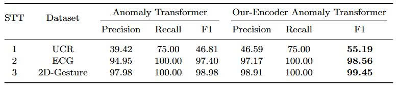
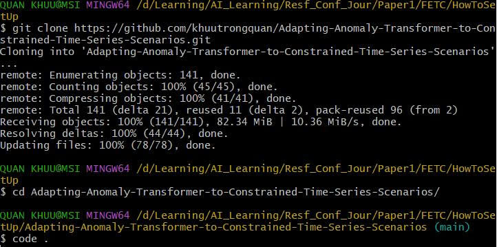
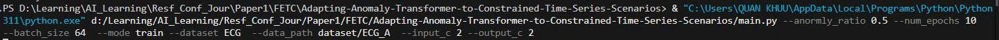
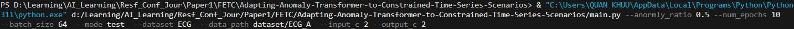

# Adapting Anomaly Transformer to Constrained Time Series Scenarios

This repository contains the implementation and experimental results of our research on Anomaly Transformer model to constrained time series scenarios.

## Abstract
Unsupervised time series anomaly detection plays a pivotal role in real-world applications where annotated data is scarce or unavailable. The primary challenge lies in constructing effective anomaly scoring mechanisms capable of distinguishing subtle abnormal patterns from normal behavior. While the Anomaly Transformer has achieved state-of-the-art results on long time series, our empirical analysis indicates a marked performance degradation when it is applied to constrained or low-dimensional datasets. We attribute this limitation to the model’s dependence on a 1D-CNN feature extractor, which often fails to capture rich temporal and dynamic dependencies—thereby diminishing the utility of the subsequent self-attention mechanism. To overcome this shortcoming, we introduce a hybrid feature extraction framework that integrates Temporal Convolutional Networks (TCNs) and standard CNNs to capture both global and local temporal features more effectively. By replacing the original embedding layer with our hybrid encoder, the model gains a more expressive representation of time-dependent patterns, improving its anomaly detection capability without additional supervision. Experimental results on three benchmark low-dimensional datasets—UCR, ECG, and 2D-Gesture—demonstrate that the proposed model consistently outperforms the baseline Anomaly Transformer in terms of F1 score, validating its robustness and generalization in constrained settings.

## Main Contributions

1. **Overall Architecture** 
   - Proposed a Hybrid Encoder to improve an ability of capturing temporal and dynamic dependencies and reduce over-reliance on self-attention mechanism of Transformer.
   - Achieve F1 score improvements of approximately 18% on the UCR dataset, 1.2% on ECG, and 0.5% on the 2D-Gesture dataset.
   <br/>
2. **Proposed Hybrid Encoder**  
   - Integrate Temporal Convolutional Networks (TCNs) and one-dimensional Convolutional Neural Networks (1D-CNNs) in parallel:
      + TCN leverages dilated causal convolutions to enable each output time step to access all preceding inputs.
      + 1D-CNN with kernel 3 is employed to capture short-range temporal patterns through localized convolutions.
   ⇒ By combining the complementary strengths of TCNs and CNNs, the Hybrid Encoder produces a more expressive input embedding, enhancing the overall capacity of the Anomaly Transformer in detecting subtle or complex anomalies in time series data.
   <br/>

## Implementation

### 1. [Original Anomaly Transformer](https://github.com/thuml/Anomaly-Transformer)
- Copy and paste the dataset and data_factory directory in our repository to the original repository.
- Run main with command-line arguments in [scripts](scripts)

### 2. [Anomaly Transformer with proposed Hybrid Encoder](https://github.com/khuutrongquan/Adapting-Anomaly-Transformer-to-Constrained-Time-Series-Scenarios)
- Directly run main with command-line arguments in [scripts](scripts)

## Experimental Results

### Datasets
- Input datasets consist of three datasets:  <br/>


### Hardware
- GPU: NVIDIA GeForce RTX 4050 GPU

### Final Results and Comparison with Original Anomaly Transformer


## Requirements

### Hardware
- CUDA-capable GPU

### Software
- CUDA Toolkit
- Python 3.7+
- Required libraries:
  ```
   torch>=1.9.0
   torchvision>=0.10.0
   numpy>=1.21.0
   scipy>=1.7.0
   scikit-learn>=1.0.0
  ```


## Guideline how to use our package on Window
### Setup Github

### Training

### Testing


## Authors

- Khuu Trong Quan<sup>1</sup> (khuutrongquan220405@gmail.com)
- Huynh Cong Viet Ngu<sup>2,</sup>* (nguhcv@fe.edu.vn)

<sup>1</sup>Department of Software Engineering, FPT University, Ho Chi Minh, Vietnam  
<sup>2</sup>Department of Computing Fundamental, FPT University, Ho Chi Minh, Vietnam  
\* Corresponding author

